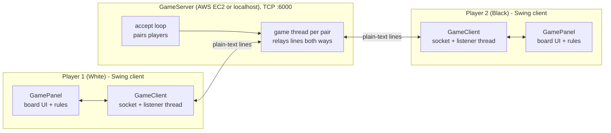
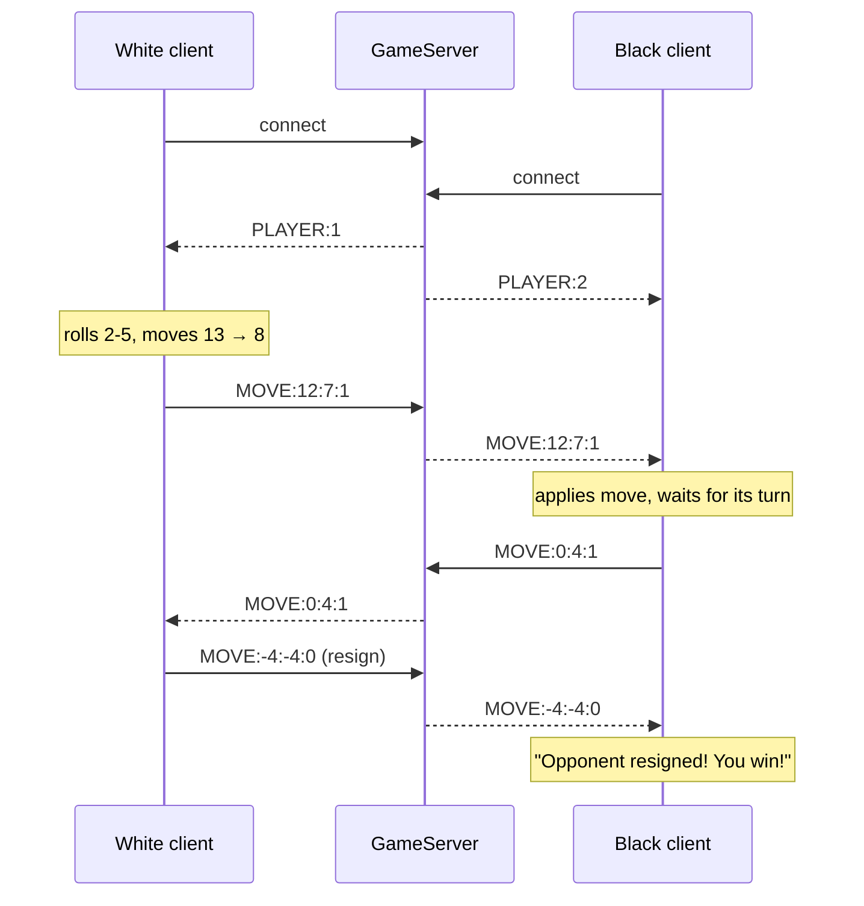

# 🎲 Backgammon Multiplayer Game

**Real-time two-player Backgammon over TCP: a Java Swing client with a full rules engine and a lightweight relay server, deployed on AWS EC2.**

<p>
  
  
  
  
  
  
</p>

Term project for **Computer Network Concepts** at Fatih Sultan Mehmet Vakıf University (FSMVU), Spring 2026.

<p align="center"></p>

## Overview

Two players on different machines connect to a central server and play a complete game of Backgammon in real time. The **server is a pure relay**: it pairs players, assigns each one a side and forwards their moves. **All game rules run on the clients**, which keep identical board states by applying each other's moves. Each pair of players gets its own server thread, so several games can run at the same time.

## Features

- **Online multiplayer over TCP**, with players matched in pairs and **multiple simultaneous games**
- **Complete rules:** dice (doubles give four moves), move direction and distance validation, blocked points (2+ opponent pieces) and a 5-pieces-per-point limit
- **Hitting and the bar:** landing on a single opponent piece sends it to the bar, and bar pieces must re-enter before any other move
- **Bearing off** once all 15 pieces are home, and **win detection**
- **Turn enforcement:** each client only lets its own side move on its turn, and a turn is passed automatically when no entry is possible
- **Restart** (both boards reset together), **resign** and **opponent-disconnect** notifications
- **Image-based board:** 48 pre-rendered triangle images (triangle colour × piece colour × 0–5 pieces × orientation), generated with `Graphics2D`
- **Configurable connection:** server port and client host/port via command-line options or environment variables

## Architecture



- **Server** (`server/GameServer`): accepts two connections, sends `PLAYER:1` / `PLAYER:2`, then starts a thread for that game. The thread forwards every line from one player to the other (one reader thread per direction) and sends `DISCONNECT:` if a player drops.
- **Client** (`client/GameClient`): connects, reads its player number, then runs a background listener thread that applies the opponent's moves to the local board (`GamePanel.applyOpponentMove`).
- **Rules** (`game/BackgammonBoard` + `client/GamePanel`): a 24-element board (`+n` = n white pieces, `−n` = n black pieces), the bar counts, the dice and all move validation.

### Protocol

Messages are newline-terminated text on one TCP connection per player:

| Message | Meaning |
|---|---|
| `PLAYER:1` / `PLAYER:2` | Server → client: your side (White / Black) |
| `MOVE:from:to:movesLeft` | A normal move between board indices 0–23, plus how many moves the mover has left this turn |
| `MOVE:-1:to:movesLeft` | Re-entering a piece from the bar |
| `MOVE:from:-2:movesLeft` | Bearing a piece off |
| `MOVE:-3:-3:0` | Restart request (both boards reset) |
| `MOVE:-4:-4:0` | Resign (the opponent is shown the win dialog) |
| `DISCONNECT:` | Server → client: the opponent's connection closed |



Real server log from the automated test game used for the screenshots below:

```text
Server started on port 6100! Waiting for players...
Player 1 connected!
Player 2 connected! Starting game...
Player 1: MOVE:12:7:1
Player 1: MOVE:12:7:0
Player 2: MOVE:0:4:1
Player 2: MOVE:0:4:0
Player 1: MOVE:23:21:1
...
Player 1: MOVE:-4:-4:0
```

## Screenshots

*Captured from a real local game: one server and two client processes, driven by an automated test.*

| Start screen | Connecting (host prefilled from config) |
|:---:|:---:|
|  |  |

| Piece selected (gold highlight) | After the move |
|:---:|:---:|
|  |  |

| Mid-game | Game end (opponent resigned) |
|:---:|:---:|
|  |  |

**Controls:** **RD** rolls the dice, **BO** bears off the selected piece, **RE** restarts, **Out** resigns. The **W:** / **B:** labels show (and select) the bar pieces, and the window title shows whose turn it is.

## Project Structure

```
.
├── BackgammonGame/                 # NetBeans (Ant) project
│   ├── src/
│   │   ├── server/GameServer.java  # TCP relay server, one thread per game
│   │   ├── client/
│   │   │   ├── GameWindow.java     # Client entry point (main)
│   │   │   ├── ClientConfig.java   # --host / --port and environment variables
│   │   │   ├── BoardPanel.java     # Start screen: name + server address
│   │   │   ├── GamePanel.java      # Board UI, rules, dice, turn handling
│   │   │   ├── GameClient.java     # Socket connection + listener thread
│   │   │   └── ImageGenerator.java # Dev tool: renders the 48 triangle images
│   │   ├── game/BackgammonBoard.java  # Board model and core rules
│   │   └── images/                 # Triangle images loaded at runtime
│   ├── lib/AbsoluteLayout.jar      # NetBeans layout library (Apache-2.0)
│   ├── nbproject/  build.xml  manifest.mf
├── docs/
│   ├── BackgammonReport.pdf        # Course report (personal and server details redacted)
│   └── screenshots/
└── README.md
```

## How to Run

Requires **JDK 17+** (developed with JDK 21). Either open `BackgammonGame/` in **Apache NetBeans** and run it, or build from the command line:

```bash
cd BackgammonGame
mkdir -p build/classes
javac -cp lib/AbsoluteLayout.jar -d build/classes $(find src -name '*.java')
cp -R src/images build/classes/
cp src/client/*.png build/classes/client/
```

### Locally (server + two clients)

```bash
# terminal 1: server (default port 6000)
java -cp build/classes server.GameServer

# terminals 2 and 3: one client each
java -cp build/classes:lib/AbsoluteLayout.jar client.GameWindow
```

Enter a name (at least 3 characters), confirm the server address (`localhost` by default) and start. The first player to connect plays **White** and the game begins when the second player joins. On Windows, use `;` instead of `:` as the classpath separator.

**Options:**

| Component | Command-line | Environment | Default |
|---|---|---|---|
| Server port | `--port 7000` | `BACKGAMMON_PORT` | `6000` |
| Client server address | `--host <address>` | `BACKGAMMON_HOST` | `localhost` |
| Client server port | `--port 7000` | `BACKGAMMON_PORT` | `6000` |

The client's `--host` value prefills the "Enter server IP" dialog, which accepts an IPv4 address, `localhost` or a host name.

### On AWS EC2

1. Launch an EC2 instance (e.g. `t3.micro`, Amazon Linux 2023) and add a **security-group inbound rule for TCP 6000** (or your chosen port).
2. Install Java and copy the server source (keep your key pair **outside** the repository, e.g. in `~/.ssh/`):

   ```bash
   scp -i ~/.ssh/<your-key>.pem -r BackgammonGame/src/server ec2-user@<EC2-PUBLIC-DNS>:~/
   ssh -i ~/.ssh/<your-key>.pem ec2-user@<EC2-PUBLIC-DNS>
   sudo dnf install -y java-21-amazon-corretto-devel
   javac server/GameServer.java
   nohup java server.GameServer --port 6000 > server.log 2>&1 &
   ```

3. Each player runs the client with the instance's public IP or DNS name:

   ```bash
   java -cp build/classes:lib/AbsoluteLayout.jar client.GameWindow --host <EC2-PUBLIC-IP-OR-DNS>
   ```

Stop or terminate the instance when you're done; the server has no authentication (see below).

## Known Limitations

- **Clients are trusted.** All rules run on the clients and the server only relays messages. Dice rolls aren't sent to the opponent, so a modified client could cheat.
- **A die can be used twice.** Moves are checked against either die value, and the used die isn't marked as spent. With a 2-5 roll, both moves can be 5s (visible in the test log above: `MOVE:12:7` twice).
- **First player's window freezes until an opponent joins.** The client waits for the server's `PLAYER:n` message on the Swing UI thread, so the first window stops responding until the second player connects.
- **No security or recovery.** Plain-text protocol with no authentication or encryption; no reconnect after a dropped connection; resigning closes the client.
- **Server resources.** Sockets of finished games aren't explicitly closed, and the server keeps no game state, so a game can't be resumed.
- **Cosmetic:** the dice button's label contains a stray invisible character before "RD".

## Author

**Saed O S Radi** — [github.com/SaadOsama10](https://github.com/SaadOsama10)
