# 🎲 Backgammon Multiplayer Game

**Real-time two-player Backgammon over TCP: a Java Swing client with a full rules engine and a lightweight relay server, deployed on AWS EC2.**

<p>
  
  
  
  
  
  
</p>

Term project for **Computer Network Concepts** at Fatih Sultan Mehmet Vakıf University (FSMVU), Spring 2026.

<p align="center">
  <a href="https://saadosama10.github.io/backgammon-network-project/play/"></a>
</p>

<p align="center">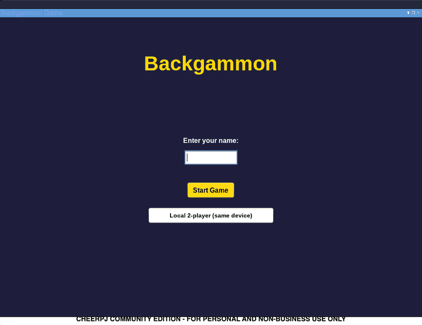</p>

> **Browser demo = local 2-player on one device.** Browsers can't open raw TCP sockets, so the demo can't connect to the game server. Online play (two machines through the server) runs in the desktop Java client. See [Local vs online play](#local-vs-online-play).

<p align="center">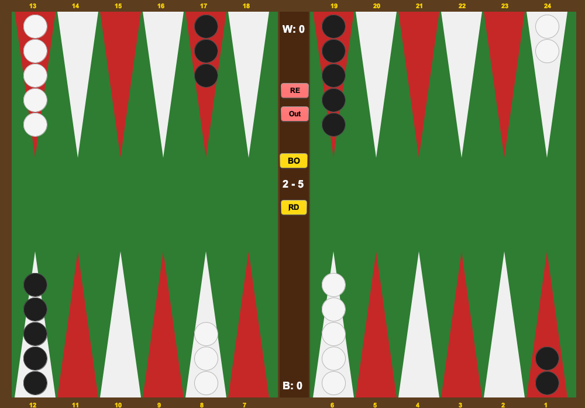</p>

## Overview

Two players on different machines connect to a central server and play a complete game of Backgammon in real time. The **server is a pure relay**: it pairs players, assigns each one a side and forwards their moves. **All game rules run on the clients**, which keep identical board states by applying each other's moves. Each pair of players gets its own server thread, so several games can run at the same time.

## Features

- **Online multiplayer over TCP**, with players matched in pairs and **multiple simultaneous games**
- **Complete rules:** dice (each die is used once; doubles give four moves), move direction and distance validation, blocked points (2+ opponent pieces) and a 5-pieces-per-point limit
- **Hitting and the bar:** landing on a single opponent piece sends it to the bar, and bar pieces must re-enter (a die of *d* enters on point 25 − *d* for White, *d* for Black) before any other move
- **Bearing off** once all 15 pieces are home, using the exact die (or a higher one from the furthest-back piece), and **win detection**
- **Turn enforcement:** each client only lets its own side move on its turn, and the turn passes automatically on both clients when no legal move remains
- **Restart** (both boards reset together), **resign** and **opponent-disconnect** notifications
- **Image-based board:** 48 pre-rendered triangle images (triangle colour × piece colour × 0–5 pieces × orientation), generated with `Graphics2D`
- **Configurable connection:** server port and client host/port via command-line options or environment variables

## Local vs online play

| | **Local 2-player** | **Online** |
|---|---|---|
| Where | Your browser ([live demo](https://saadosama10.github.io/backgammon-network-project/play/)) or the desktop client's **Local 2-player (same device)** button | Desktop Java client + `GameServer` |
| Players | Two people taking turns on one device | Two machines, anywhere the server is reachable |
| Network | None | TCP, port 6000 |
| How it works | Both players run the real game logic, connected by an in-memory `LocalTransport` that exchanges the same `PLAYER:n` / `MOVE:...` messages; the window shows the board of whoever's turn it is | `GameClient` talks to `GameServer` over a socket (see [Protocol](#protocol)) |

The browser demo is built with [CheerpJ](https://cheerpj.com/) (Java in WebAssembly), which runs the Swing client unchanged in the page. Browsers don't allow raw TCP sockets, so the server can't be reached from there; that is why the demo is local-only. For online play, [run the server and two desktop clients](#how-to-run).

Both modes share one `Transport` interface (`sendMove`, `getPlayerNumber`): `GameClient` is the TCP implementation (unchanged), `LocalTransport` the in-memory one. The rules, dice, turn handling and win dialogs are the same code in both. The one local-mode difference: resigning doesn't exit the program, because both players live in the same JVM.

## Architecture

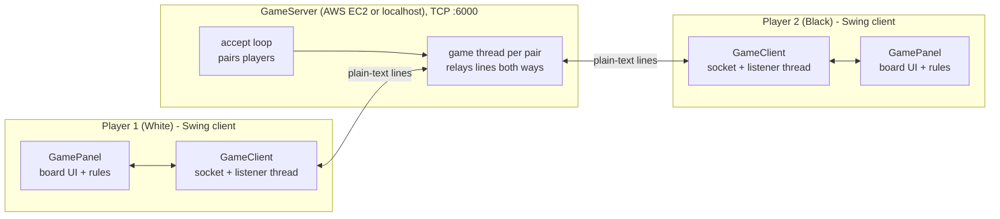

- **Server** (`server/GameServer`): accepts two connections, sends `PLAYER:1` / `PLAYER:2`, then starts a thread for that game. The thread forwards every line from one player to the other (one reader thread per direction) and sends `DISCONNECT:` if a player drops.
- **Client** (`client/GameClient`): connects, reads its player number, then runs a background listener thread that applies the opponent's moves to the local board (`GamePanel.applyOpponentMove`).
- **Rules** (`game/BackgammonBoard` + `client/GamePanel`): a 24-element board (`+n` = n white pieces, `−n` = n black pieces), the bar counts, the dice and all move validation.

### Protocol

Messages are newline-terminated text on one TCP connection per player:

| Message | Meaning |
|---|---|
| `PLAYER:1` / `PLAYER:2` | Server → client: your side (White / Black) |
| `MOVE:from:to:movesLeft` | A normal move between board indices 0–23, plus how many moves the mover has left this turn |
| `MOVE:-1:to:movesLeft` | Re-entering a piece from the bar |
| `MOVE:from:-2:movesLeft` | Bearing a piece off |
| `MOVE:-3:-3:0` | Restart request (both boards reset) |
| `MOVE:-4:-4:0` | Resign (the opponent is shown the win dialog) |
| `MOVE:-5:-5:0` | Pass: the mover has no legal move left, so the turn switches |
| `DISCONNECT:` | Server → client: the opponent's connection closed |

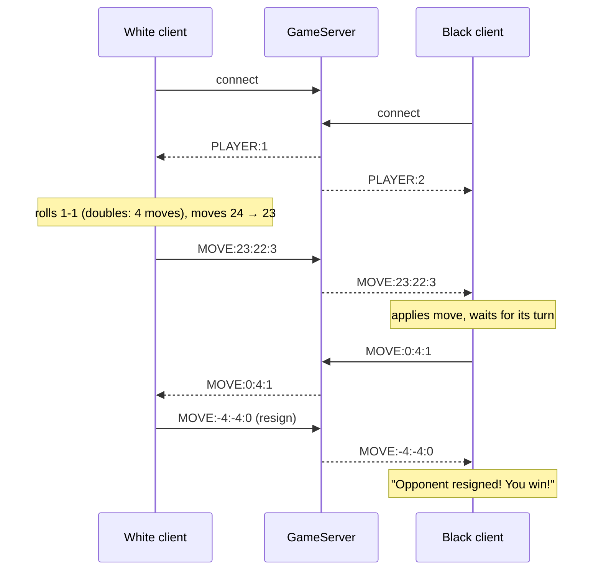

Real server log from the automated test game used for the screenshots below:

```text
Server started on port 6101! Waiting for players...
Player 1 connected!
Player 2 connected! Starting game...
Player 1: MOVE:23:22:3
Player 1: MOVE:23:22:2
Player 1: MOVE:22:21:1
Player 1: MOVE:22:21:0
Player 2: MOVE:0:4:1
Player 2: MOVE:0:3:0
Player 1: MOVE:21:17:1
Player 1: MOVE:21:19:0
...
Player 1: MOVE:-4:-4:0
```

## Screenshots

*Captured from a real local game: one server and two client processes, driven by an automated test.*

| Start screen | Connecting (host prefilled from config) |
|:---:|:---:|
| 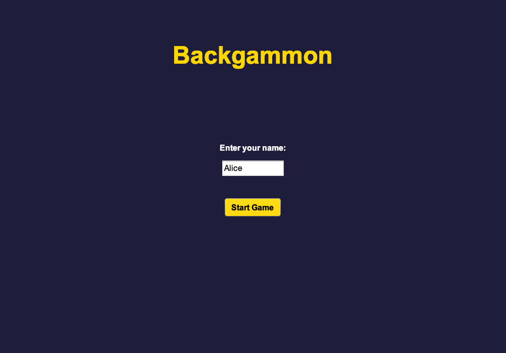 | 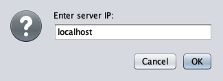 |

| Waiting for an opponent (window stays responsive) | Reusing a spent die is rejected |
|:---:|:---:|
| 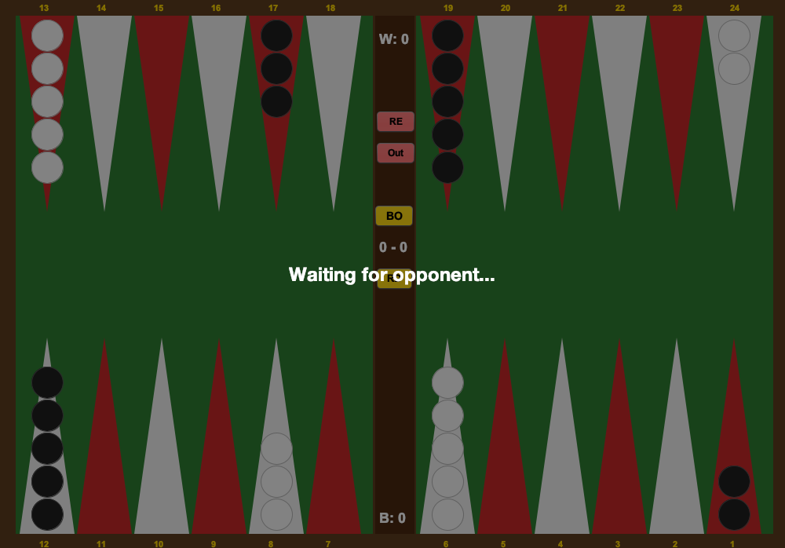 | 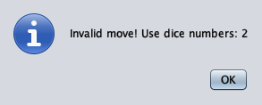 |

| Piece selected (gold highlight) | After the move |
|:---:|:---:|
| 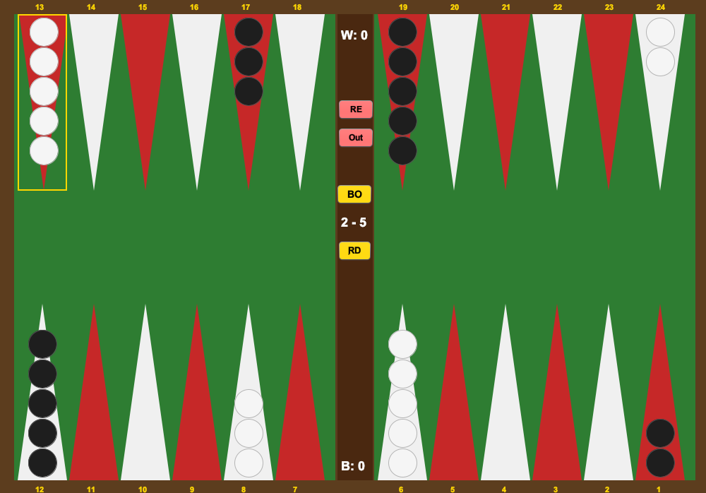 | 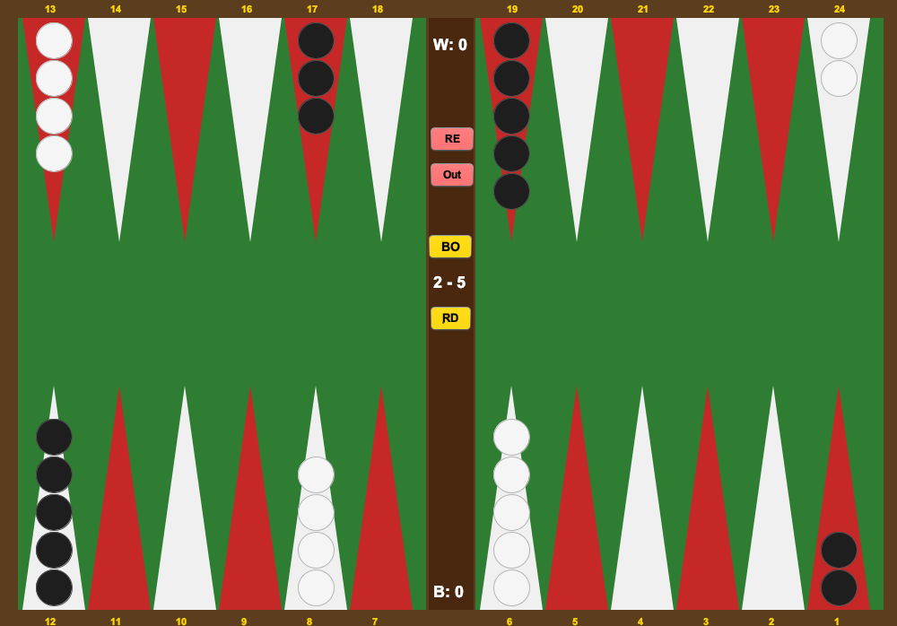 |

| Mid-game | Game end (opponent resigned) |
|:---:|:---:|
| 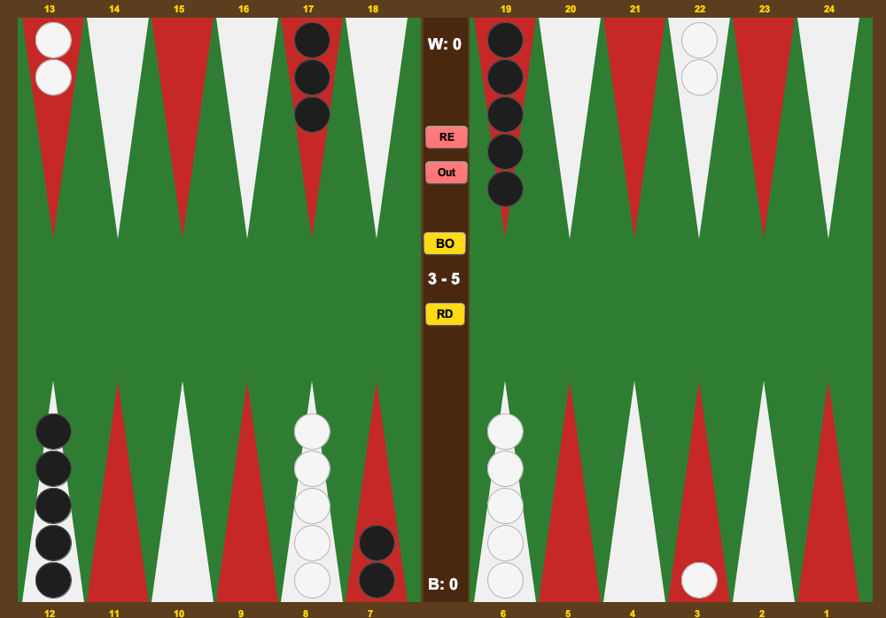 | 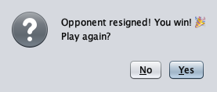 |

| Server unreachable |
|:---:|
| 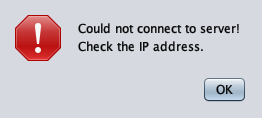 |

**Controls:** **RD** rolls the dice, **BO** bears off the selected piece, **RE** restarts, **Out** resigns. The **W:** / **B:** labels show (and select) the bar pieces, and the window title shows whose turn it is.

## Project Structure

```
.
├── BackgammonGame/                 # NetBeans (Ant) project
│   ├── src/
│   │   ├── server/GameServer.java  # TCP relay server, one thread per game
│   │   ├── client/
│   │   │   ├── GameWindow.java     # Client entry point (main)
│   │   │   ├── ClientConfig.java   # --host / --port and environment variables
│   │   │   ├── BoardPanel.java     # Start screen: name + server address
│   │   │   ├── GamePanel.java      # Board UI, rules, dice, turn handling
│   │   │   ├── GameClient.java     # TCP transport: socket connection + listener thread
│   │   │   ├── Transport.java      # How a panel sends moves (TCP or in-memory)
│   │   │   ├── LocalTransport.java # In-memory transport for local 2-player mode
│   │   │   ├── LocalGame.java      # Local mode: two panels, shows whoever's turn it is
│   │   │   └── ImageGenerator.java # Dev tool: renders the 48 triangle images
│   │   ├── game/BackgammonBoard.java  # Board model and core rules
│   │   └── images/                 # Triangle images loaded at runtime
│   ├── test/client/                # Automated tests (TCP game, local mode)
│   ├── run-tests.sh  build-web.sh  # Run the tests / build the browser jar
│   ├── lib/AbsoluteLayout.jar      # NetBeans layout library (Apache-2.0)
│   ├── nbproject/  build.xml  manifest.mf
├── docs/
│   ├── play/                       # Browser demo (GitHub Pages): index.html + backgammon.jar
│   ├── BackgammonReport.pdf        # Course report (personal and server details redacted)
│   └── screenshots/
└── README.md
```

## How to Run

Requires **JDK 17+** (developed with JDK 21). Either open `BackgammonGame/` in **Apache NetBeans** and run it, or build from the command line:

```bash
cd BackgammonGame
mkdir -p build/classes
javac -cp lib/AbsoluteLayout.jar -d build/classes $(find src -name '*.java')
cp -R src/images build/classes/
cp src/client/*.png build/classes/client/
```

### Locally (server + two clients)

```bash
# terminal 1: server (default port 6000)
java -cp build/classes server.GameServer

# terminals 2 and 3: one client each
java -cp build/classes:lib/AbsoluteLayout.jar client.GameWindow
```

Enter a name (at least 3 characters), confirm the server address (`localhost` by default) and start. The first player to connect plays **White** and the game begins when the second player joins. On Windows, use `;` instead of `:` as the classpath separator.

**Options:**

| Component | Command-line | Environment | Default |
|---|---|---|---|
| Server port | `--port 7000` | `BACKGAMMON_PORT` | `6000` |
| Client server address | `--host <address>` | `BACKGAMMON_HOST` | `localhost` |
| Client server port | `--port 7000` | `BACKGAMMON_PORT` | `6000` |

The client's `--host` value prefills the "Enter server IP" dialog, which accepts an IPv4 address, `localhost` or a host name.

### Tests

```bash
cd BackgammonGame
./run-tests.sh          # TCP game (real server + 2 clients) and local 2-player mode
```

`TcpGameTest` plays a real game through `GameServer` with two clients and checks both boards stay identical. `LocalModeTest` drives the local mode: moves and turn handover, dice rules (a spent die can't be reused, doubles give four moves), hitting and bar entry, bear-off (exact and higher die), the win dialog, restart and resign. The tests open real Swing windows, so they need a display.

### Browser demo

```bash
cd BackgammonGame
./build-web.sh          # compiles with --release 11 (CheerpJ runs Java 8/11/17) -> docs/play/backgammon.jar
```

`docs/play/` is served by GitHub Pages. To try it locally, serve `docs/` with a web server that supports HTTP `Range` requests (CheerpJ needs them).

### On AWS EC2

1. Launch an EC2 instance (e.g. `t3.micro`, Amazon Linux 2023) and add a **security-group inbound rule for TCP 6000** (or your chosen port).
2. Install Java and copy the server source (keep your key pair **outside** the repository, e.g. in `~/.ssh/`):

   ```bash
   scp -i ~/.ssh/<your-key>.pem -r BackgammonGame/src/server ec2-user@<EC2-PUBLIC-DNS>:~/
   ssh -i ~/.ssh/<your-key>.pem ec2-user@<EC2-PUBLIC-DNS>
   sudo dnf install -y java-21-amazon-corretto-devel
   javac server/GameServer.java
   nohup java server.GameServer --port 6000 > server.log 2>&1 &
   ```

3. Each player runs the client with the instance's public IP or DNS name:

   ```bash
   java -cp build/classes:lib/AbsoluteLayout.jar client.GameWindow --host <EC2-PUBLIC-IP-OR-DNS>
   ```

Stop or terminate the instance when you're done; the server has no authentication (see below).

## Improvements

Changes made after the original course version:

- **Each die can only be used once.** Moves used to be checked against either die value without marking the die as spent, so a 4-2 roll could be played as 4 + 4. The client now tracks which die was played (normal moves and bar entry) and only accepts the remaining one; doubles still give four moves.
- **Correct bar entry.** The entry point was computed one point off (`23 − to` / `to` instead of `24 − to` / `to + 1`), so a 6 could never re-enter and the last point needed a die of 0. A die of *d* now enters White on point 25 − *d* and Black on point *d*.
- **Bearing off uses the dice.** **BO** used to check only that all pieces were home. It now needs the exact die for the selected piece, or a higher die when no piece is further back, and spends that die. A rejected attempt clears the selection.
- **Turn passing stays in sync.** When no move was possible, the old "Turn lost" path switched the turn on the local client only, so the opponent kept waiting and the game deadlocked. The client now checks for any legal move after each roll and each move (bar entry, normal moves and bearing off). If none remains, it passes the turn and sends `MOVE:-5:-5:0` so both boards switch together.
- **Responsive while waiting for an opponent.** Connecting blocked the Swing UI thread until the server paired the players, freezing the first player's window. The connection now runs in a background `SwingWorker`; a "Waiting for opponent..." overlay blocks board input until a side is assigned.
- **Connection errors are reported.** A failed connection used to be swallowed silently; the client now shows *Could not connect to server!* and returns to the start screen.
- **Clean "RD" label.** Removed an invisible Arabic diacritic (U+064D) that preceded the dice button's label (in both `GamePanel.java` and the NetBeans `.form`).
- **Repository and build:** proper `.gitignore`, duplicate image folder removed, configurable host/port, bundled `AbsoluteLayout.jar` so the project builds without NetBeans, and a portable output path for `ImageGenerator`.

These fixes were verified with an automated local game (server + two clients): the UI thread stayed responsive while waiting, reusing a spent die was rejected with the board unchanged, doubles gave four moves, and resign/game-end and the unreachable-server path worked. Separate rules tests drove the real `GamePanel` through every bar entry (dice 1–6, both colours), exact, higher and rejected bear-offs, and automatic passes; a socket test confirmed the server relays the pass message both ways.

## Known Limitations

- **Clients are trusted.** All rules run on the clients and the server only relays messages. Dice rolls aren't sent to the opponent, so a modified client could cheat.
- **No security or recovery.** Plain-text protocol with no authentication or encryption; no reconnect after a dropped connection; resigning closes the client.
- **Server resources.** Sockets of finished games aren't explicitly closed, and the server keeps no game state, so a game can't be resumed.

## Author

**Saed O S Radi** — [github.com/SaadOsama10](https://github.com/SaadOsama10)
